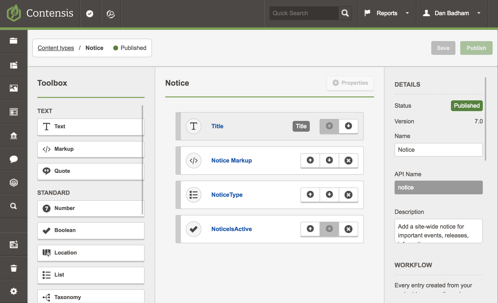
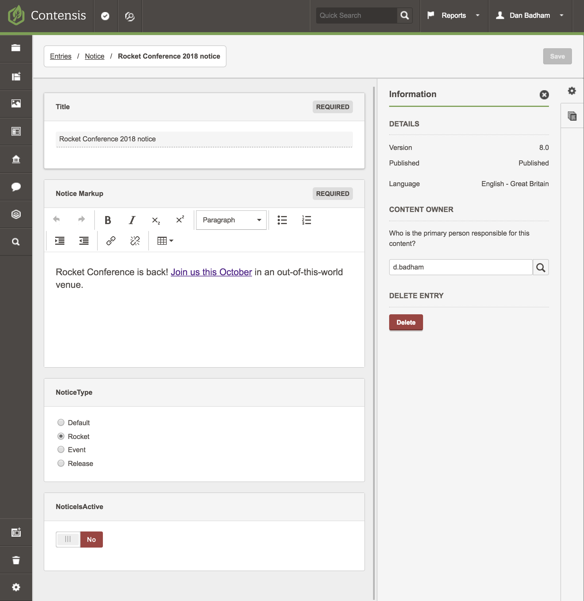

# contensis-noticebar
A very basic notice bar for a website using Contensis content types and entries.

# Instructions
1. Copy the code from the noticebar.cshtml file to a razorview in your Contensis project.
2. Create a new content type called 'notice'
3. Add the fields as shown in the screenshot below:

- Title (text field)
- Notice Markup (a markup field)
- Notice Type (list field so you can add a comma separated list of notice types such as Default,Important,Event)
- Notice Is Active (boolean)






# CSS / SASS
You'll need your own css :)

Or something like the following:


```
.notice {
    position:sticky;
    top:0;
    z-index:250;
    background:$bg-primary;
    color:$color-light;
    padding:8px 20px;
    text-align: center;
    // box-shadow: 0px 5px 20px $color-dark;
    p{
        margin:0;
        padding:0;
    }
    a {
        color:$color-light;
        border-bottom:1px solid rgba(255,255,255,0.2);
    }
}

// Colour options that can be set in entries
.notice--rocket {
    background:#35424d;
    color:$color-light;
}


// CSS only close button
.close {
    position: absolute;
    right: 10px;
    top: 10px;
    width: 22px;
    height: 22px;
    opacity: 0.3;
    border-bottom:0 none !important;
  }
  .close:hover {
    opacity: 1;
  }
  .close:before, .close:after {
    position: absolute;
    left: 10px;
    content: ' ';
    height: 23px;
    width: 2px;
    background-color: #fff;
  }
  .close:before {
    transform: rotate(45deg);
  }
  .close:after {
    transform: rotate(-45deg);
  }
  ```
  
